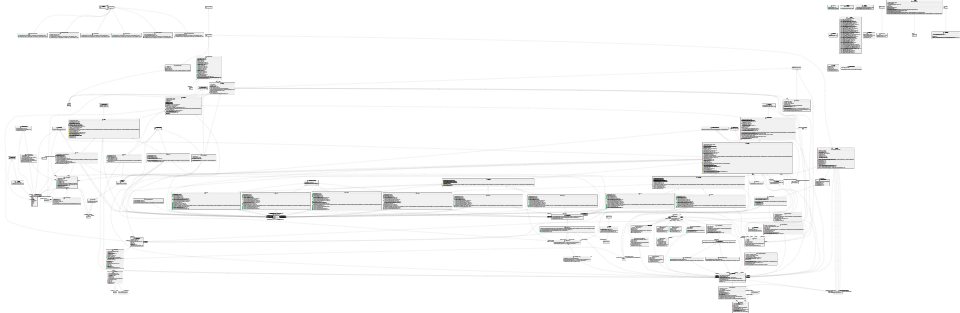
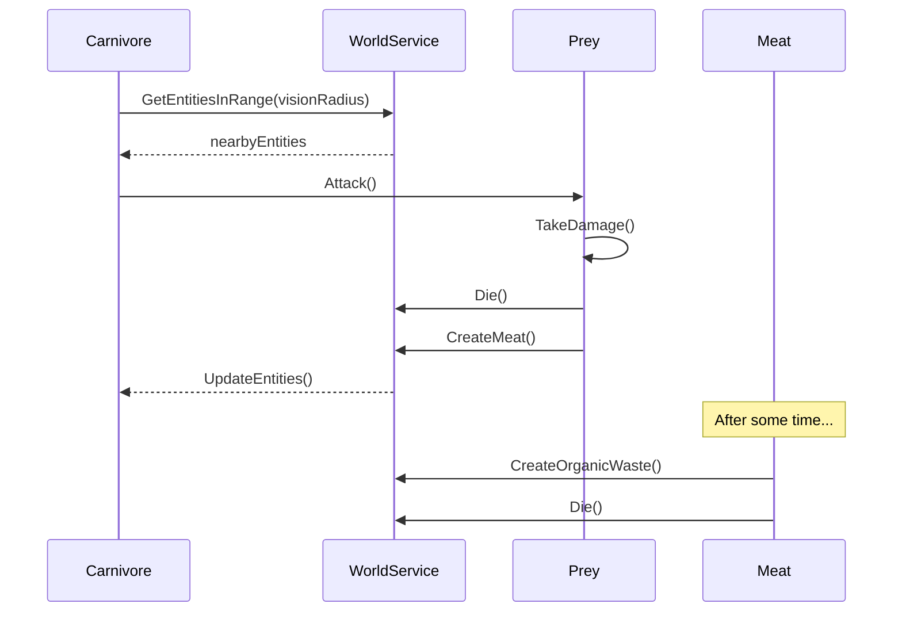
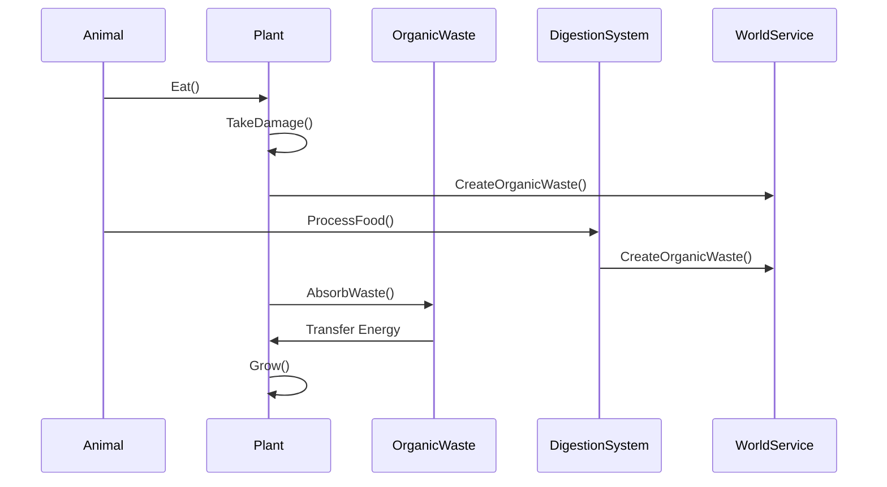
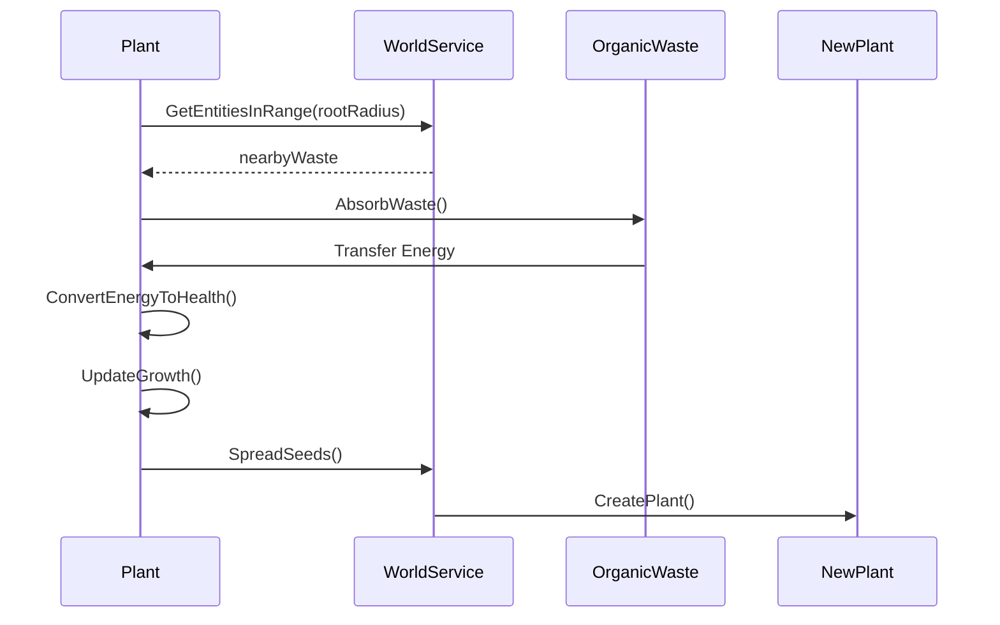
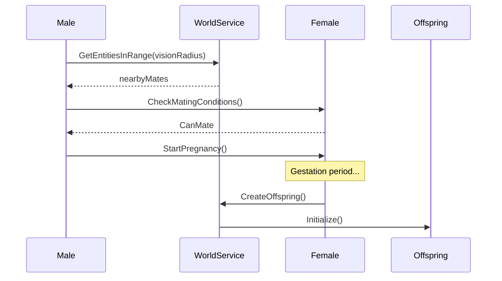
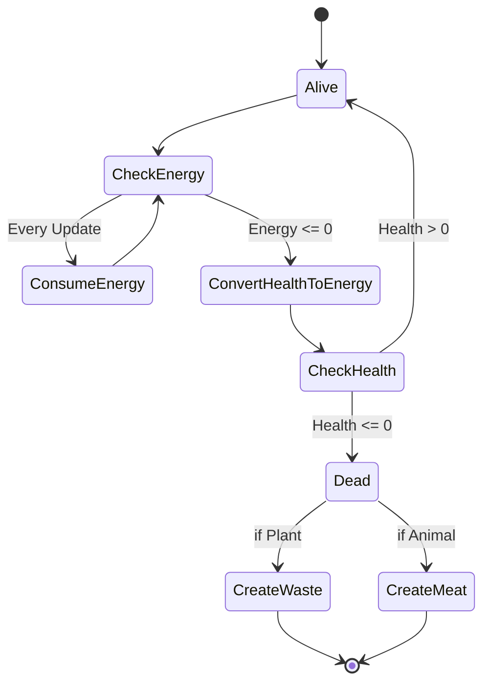
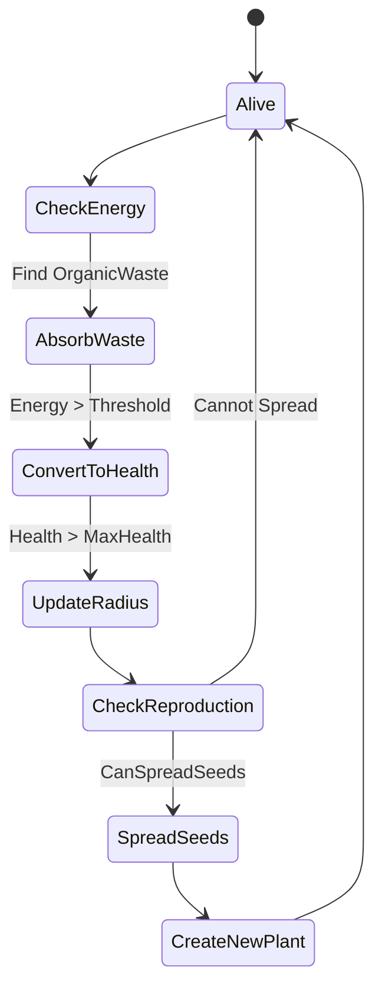
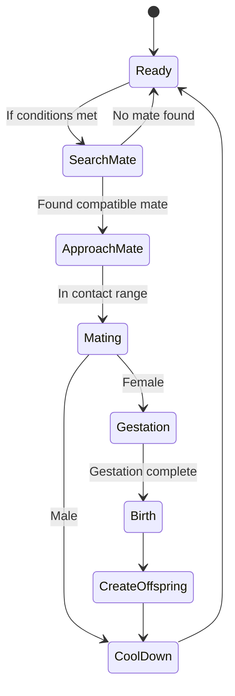
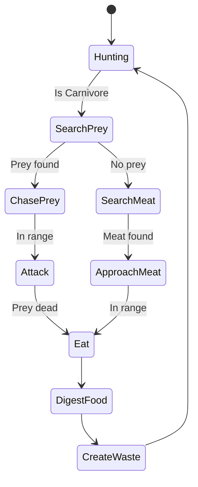

# Ecosystem Project Report 

## Introduction
This project simulates a simplified ecosystem where different life forms interact in a 2D world. Animals and plants must manage their energy, survive, feed, and reproduce while following natural laws and behaviors.

## Class Diagram

The class diagram was generated using PlantUML. It shows the core architecture of the ecosystem simulation:



1. **Core Entities Hierarchy**:
   - `Entity`: Base abstract class with position and visual properties
   - `LifeForm`: Extends Entity with health and energy mechanics
   - `MoveableEntity`: Base for entities that can move, handles environment interactions
   - `Animal` and `Plant`: Main branches of life forms with specific behaviors

2. **Behavior System**:
   - `IBehavior<T>`: Core interface for implementing behaviors
   - Implementation examples:
     - `HungerBehavior`: Controls eating and food searching
     - `FleeingBehavior`: Handles escape from predators
     - `GroupMovementBehavior`: Manages group dynamics
     - `PheromoneEmittingBehavior`: For reproduction mechanics

3. **Services Layer**:
   - `WorldService`: Manages world state and entity interactions
   - `EntityFactory`: Handles entity creation and initialization
   - `SimulationEngine`: Controls simulation flow and updates
   - `TimeManager`: Manages simulation timing and speed

4. **Helper Classes**:
   - `RandomHelper`: Centralized RNG with seed management
   - `MathHelper`: Mathematical utilities for distance calculations
   - `AssetHelper`: Manages sprite and resource loading
   - Various converters for UI value transformations

5. **Concrete Implementations**:
   - Carnivores: `Fox`, `Shark`
   - Herbivores: `Fish`, `Duck`, `Squirrel`
   - Plants: `Grass`, `Algae`
   - Each with specific attributes and behaviors

## Sequence Diagram

The sequence diagrams illustrate key interactions in the ecosystem:

### 1. **Hunting Sequence**:
   - Shows how carnivores detect, chase, and catch prey
   - Demonstrates the transformation of dead prey into meat


### 2. **Herbivore Food Chain Cycle**
   - Shows the complete cycle from living entities to waste
   - Demonstrates how energy flows through the ecosystem
   - Illustrates the recycling of resources


### 3. **Plant Growth and Reproduction**:
   - Details how plants absorb waste for energy
   - Shows the energy-to-health conversion process
   - Illustrates the seed spreading mechanism



### 4. **Animal Reproduction**:
   - Demonstrates mate finding and selection
   - Shows the gestation period handling
   - Illustrates offspring creation and placement


## Activity Diagram
The activity diagrams illustrate the key processes and decision flows in our ecosystem simulation:

### 1. Life Cycle Process
This diagram shows the basic life and death cycle of all entities:
- Continuous energy consumption and health monitoring
- Conversion of health to energy when starving 
- Death conditions and transformation into waste/meat
- Different end states for plants and animals


### 2. Plant Growth and Reproduction
Illustrates the plant lifecycle including:
- Organic waste absorption mechanics
- Energy to health conversion process
- Growth based on excess health
- Reproduction through seed spreading
- Environmental validation for new plants


### 3. Animal Reproduction Process
Shows the complete mating sequence:
- Initial condition checking (energy, cooldowns)
- Mate finding and approach
- Gender-specific behaviors (male/female)
- Gestation period handling
- Offspring creation and placement
- Reproduction cooldown management


### 4. Hunting and Feeding Process
Details predator-prey interactions:
- Prey detection and chase mechanics
- Attack execution when in range
- Alternative food source searching
- Digestion and waste creation
- Return to hunting state


---
# SOLID Principles

## First Principle : Single-Responsability-Principle
SRP states that **a class should have only one reason to change**. 

### Implementation

#### Example n°1 : `Animal.cs`
- **Responsibility:**  
  The `Animal` class manages the **internal state** and **core behaviors** of an animal. This includes properties like health, energy, reproduction, and digestion, as well as handling associated behaviors. Crucially, it does not manage external concerns such as the environment or interactions with other entities, which are delegated to classes like `WorldService` or `EntityLocator`.

- **Code:**
  ```csharp
    public abstract class Animal : MoveableEntity, IEnvironmentSensitive, IHasVisionRange, IAnimatable
    {
        private double _behaviorUpdateAccumulator;
        protected readonly IEntityLocator<Animal> _entityLocator;
        protected readonly IWorldService _worldService;
        private readonly List<IBehavior<Animal>> _behaviors;
        private readonly IEntityFactory _entityFactory;
        private readonly IDigestive _digestionSystem;
        protected readonly List<EnvironmentPreference> _environmentPreferences = new();
        public IReadOnlyList<EnvironmentPreference> PreferredEnvironments => _environmentPreferences;
        public abstract EnvironmentType PreferredEnvironment { get; }
        private double _biteCooldown = 0;
        protected abstract double BaseBiteCooldownDuration { get; }
        private bool _hasDied = false;

        protected Animal(
            IEntityLocator<Animal> entityLocator,
            IWorldService worldService,
            ITimeManager timeManager,
            IEntityFactory entityFactory,
            Position position,
            int healthPoints,
            int energy,
            bool isMale,
            double visionRadius,
            double contactRadius,
            double basalMetabolicRate,
            EnvironmentType environment) 
            : base(position, healthPoints, energy, environment, basalMetabolicRate, timeManager)
        {
            _entityLocator = entityLocator;
            _worldService = worldService;
            _entityFactory = entityFactory;
            _digestionSystem = new DigestionSystem(this, _worldService, _timeManager);
            IsMale = isMale;
            VisionRadius = visionRadius;
            ContactRadius = contactRadius;
            _behaviors = new List<IBehavior<Animal>>();
            AddBaseBehaviors();
        }

        public bool IsMale { get; set; }
        public double VisionRadius { get; protected set; }
        public bool IsAdult { get; set; }
        public double ReproductionCooldown { get; set; }
        public double HungerThreshold { get; set; }
        public double ReproductionEnergyThreshold { get; set; }
        public double ReproductionEnergyCost { get; set; }
        public bool IsPregnant { get; set; }
        public IWorldService WorldService => _worldService;

        public void AddBehavior(IBehavior<Animal> behavior)
        {
            _behaviors.Add(behavior);
        }

        private void AddBaseBehaviors()
        {
            if (!IsMale)
            {
                AddBehavior(new PheromoneEmittingBehavior(_worldService));  // Priority 1
                AddBehavior(new BirthBehavior());                           // Priority 4
            }
            else
            {
                AddBehavior(new PheromoneAttractedBehavior(_worldService)); // Priority 2
            }

            AddBehavior(new RestBehavior());                                // Priority 0
        }

        protected override void UpdateBehavior()
        {
            _behaviorUpdateAccumulator += _timeManager.DeltaTime;

            if (_behaviorUpdateAccumulator >= SimulationConstants.BEHAVIOR_UPDATE_INTERVAL)
            {
                if (_biteCooldown > 0)
                {
                    _biteCooldown -= _timeManager.DeltaTime;
                }

                var currentEnv = _worldService.GetEnvironmentAt(Position);
                var envPreference = GetBestEnvironmentPreference(currentEnv);

                if (envPreference.Type == EnvironmentType.None)
                {
                    TakeDamage(SimulationConstants.ENVIRONMENT_DAMAGE_RATE);
                }

                var behavior = GetCurrentBehavior();
                if (behavior != null)
                {
                    behavior.Execute(this);
                }

                if (IsPregnant)
                {
                    if (_currentPregnancy.HasValue)
                    {
                        _currentPregnancy = new Pregnancy
                        {
                            GestationProgress = _currentPregnancy.Value.GestationProgress + _timeManager.DeltaTime,
                            Father = _currentPregnancy.Value.Father
                        };
                    }
                }

                _digestionSystem.ProcessDigestion(_timeManager.DeltaTime);

                _behaviorUpdateAccumulator = 0;
            }
        }

        protected bool CanBiteBasedOnCooldown()
        {
            return _biteCooldown <= 0;
        }

        protected void SetBiteCooldown()
        {
            _biteCooldown = BaseBiteCooldownDuration;
        }

        protected override void Die()
        {
            if (_hasDied) return;
            _hasDied = true;

            int meatCount = (int)Math.Floor(MaxHealth * 0.5 / 20.0);

            CreateMeat(meatCount);
            _worldService.RemoveEntity(this);
        }

        private void CreateMeat(int count)
        {
            for (int i = 0; i < count; i++)
            {
                var (x, y) = RandomHelper.GetRandomPositionInRadius(
                    Position.X, 
                    Position.Y, 
                    ContactRadius * 2);

                x = Math.Clamp(x, 0, 1);
                y = Math.Clamp(y, 0, 1);

                var meatPosition = new Position(x, y);
                var meat = _entityFactory.CreateMeat(meatPosition);
                _worldService.AddEntity(meat);
            }
        }

        public EnvironmentPreference GetBestEnvironmentPreference(EnvironmentType currentEnv)
        {
            return PreferredEnvironments
                .Where(p => (p.Type & currentEnv) != 0)
                .OrderByDescending(p => p.MovementModifier)
                .FirstOrDefault() 
                ?? new EnvironmentPreference(EnvironmentType.None, 0.3, 3.0);
        }

        public abstract Animal CreateOffspring(Position position);

        protected override IBehavior<LifeForm>? GetCurrentBehavior()
        {
            var behavior = _behaviors
                .Where(b => 
                {
                    var canExecute = b.CanExecute(this);
                    return canExecute;
                })
                .OrderByDescending(b => b.Priority)
                .FirstOrDefault();

            if (behavior != null)
            {
                Stats.CurrentBehavior = behavior.Name;
                return new BehaviorWrapper<Animal, LifeForm>(behavior, this);
            }

            Stats.CurrentBehavior = "None";
            return null;
        }

        public void ConvertEnergyToHealth(double amount)
        {
            if (Energy >= SimulationConstants.HEALING_ENERGY_THRESHOLD &&
                HealthPoints < MaxHealth)
            {
                var excessEnergy = Math.Min(amount, Energy - SimulationConstants.HEALING_ENERGY_THRESHOLD);
                var healingAmount = (int)(excessEnergy * SimulationConstants.HEALING_CONVERSION_RATE);

                if (healingAmount > 0)
                {
                    RemoveEnergy(healingAmount);
                    Heal(healingAmount);
                }
            }
        }

        public void Heal(int amount)
        {
            HealthPoints = Math.Min(MaxHealth, HealthPoints + amount);
        }

        protected struct Pregnancy
        {
            public double GestationProgress { get; set; }
            public Animal Father { get; set; }
        }
        private Pregnancy? _currentPregnancy;

        public void StartPregnancy(Animal father)
        {
            if (!IsPregnant && !IsMale)
            {
                IsPregnant = true;
                _currentPregnancy = new Pregnancy 
                { 
                    GestationProgress = 0,
                    Father = father
                };
            }
        }

        public bool IsReadyToGiveBirth()
        {
            return IsPregnant && 
                _currentPregnancy.HasValue && 
                _currentPregnancy.Value.GestationProgress >= SimulationConstants.GESTATION_PERIOD;
        }

        protected void ProcessFoodConsumption(int amount)
        {
            _digestionSystem.AddFood(amount);
        }

        public virtual AnimatedSprite? Sprite { get; protected set; }
        public virtual AnimationState CurrentState { get; protected set; }

        protected virtual AnimationState DetermineAnimationState()
        {
            if (IsDead) return AnimationState.Dead;
            return MovementSpeed > 0 ? AnimationState.Moving : AnimationState.Idle;
        }

        protected IAnimationManager? _animationManager;

        protected virtual void InitializeSprite(string spritePath, int frameWidth, int frameHeight)
        {
            Sprite = new AnimatedSprite(spritePath, frameWidth, frameHeight);
            _animationManager = new AnimationManager(Sprite);
        }

        public virtual void UpdateAnimation(double deltaTime)
        {
            if (_animationManager == null) return;

            if (!_animationManager.HasQueuedAnimations)
            {
                bool isMoving = Math.Abs(_currentDirectionX) > 0.01 || 
                            Math.Abs(_currentDirectionY) > 0.01;

                if (isMoving && _animationManager.CurrentState != AnimationState.Moving)
                {
                    _animationManager.PlayAnimation(new AnimationEvent(AnimationState.Moving));
                }
            }

            _animationManager.Update(deltaTime);
        }
    }

### **Justification**

- **Clear Separation of Concerns:**
The Animal class exclusively handles the animal's internal properties and functions:
Managing health, energy, reproduction, and associated behaviors.
Processing digestion via an external DigestionSystem.
Delegating animation through the IAnimatable interface.
External interactions like environment management (e.g., adding/removing entities) are handled by WorldService, while spatial queries rely on EntityLocator.

- **Single Reason to Change:**
Changes to the Animal class would only be required if there’s a modification in how an animal’s internal state or behavioral system operates.
For example:
Introducing a new state (e.g., hibernation) would affect Animal.
Modifying digestion or environment logic would not require changes in Animal.


- **The class is modular and extensible:**
Adding new behaviors (e.g., HuntingBehavior) only involves registering them in the behavior system.
Adjustments to digestion are isolated within the DigestionSystem class, which does not impact the core Animal logic. This result in a better maintainability.
    
- **Why This Respects SRP:**
The Animal class focuses solely on the internal state and behaviors of an animal.
It avoids mixing concerns like environment interaction, graphical representation, or spatial queries, ensuring each responsibility is isolated.
    


#### Example n°2 : `WorldService.cs`
- **Responsibility**: The `WorldService` class is solely responsible for managing entities within the simulation environment, such as adding and removing entities or getting basic information needed for the interactions such as the distance and the position.
- **Code:**
  ```csharp
      public interface IWorldService
    {
        ObservableCollection<Entity> Entities { get; }
        GridWorld Grid { get; }
        void AddEntity(Entity entity);
        void RemoveEntity(Entity entity);
        EnvironmentType GetEnvironmentAt(Position position);
        IEnumerable<Entity> GetEntitiesInRange(Position position, double radius);
        void ProcessEntityQueues();
    }

    public class WorldService : IWorldService
    {
        private readonly object _lock = new object();
        public ObservableCollection<Entity> Entities { get; } = new();
        private readonly ConcurrentQueue<Entity> _entitiesToAdd = new();
        private readonly ConcurrentQueue<Entity> _entitiesToRemove = new();
        public GridWorld Grid { get; }

        public WorldService()
        {
            Grid = new GridWorld(800, 520);
        }

        public void AddEntity(Entity entity)
        {
            ArgumentNullException.ThrowIfNull(entity);
            _entitiesToAdd.Enqueue(entity);
        }

        public void RemoveEntity(Entity entity)
        {
            _entitiesToRemove.Enqueue(entity);
        }

        public void ProcessEntityQueues()
        {
            lock (_lock)
            {
                bool changes = false;

                while (_entitiesToRemove.TryDequeue(out var entityToRemove))
                {
                    if (Entities.Remove(entityToRemove))
                    {
                        changes = true;
                        Console.WriteLine($"Removed entity: {entityToRemove.GetType().Name}");
                    }
                }

                while (_entitiesToAdd.TryDequeue(out var entityToAdd))
                {
                    Entities.Add(entityToAdd);
                    changes = true;
                    Console.WriteLine($"Added entity: {entityToAdd.GetType().Name}");
                }

                if (changes)
                {
                    Console.WriteLine($"Current entity count: {Entities.Count}");
                }
            }
        }

        public EnvironmentType GetEnvironmentAt(Position position)
        {
            int x = (int)(position.X * Grid.Width);
            int y = (int)(position.Y * Grid.Height);
            var environment = Grid.GetEnvironmentAt(x, y);

            // Console.WriteLine($"Getting environment at ({position.X},{position.Y}) -> ({x},{y}): {environment}");
            return environment;
        }

        public IEnumerable<Entity> GetEntitiesInRange(Position position, double radius)
        {
            lock (_lock)
            {
                return Entities.Where(e => GetDistance(position, e.Position) <= radius).ToList();
            }
        }

        private double GetDistance(Position pos1, Position pos2)
        {
            var dx = pos1.X - pos2.X;
            var dy = pos1.Y - pos2.Y;
            return Math.Sqrt(dx * dx + dy * dy);
        }
    }


### Justification
- **Clear Separation of Concerns:**
The WorldService class does not handle the logic of the entities themselves (e.g., their behaviors or interactions). It solely manages their presence within the simulation environment.

- **Single Reason to Change:**
The only reason to modify this class would be if the way entities are added, removed, or processed in the simulation changes.

    
- **Better Maintainability:**
By isolating the responsibility for entity management, the class remains simple, and any changes in entity logic or behavior do not affect this part of the code.
    
    
    
    
**Other Examples of SRP in the Project :**

**TimeManager.cs:** 
Handles only the progression of time in the simulation.
Provides functionality to manage time-related operations like ticking, starting, and pausing.
    
**EntityViewModel.cs:**
Manages the visual representation of entities without interfering with their logic or behavior.
Benefits of SRP in the Project
Simplifies debugging and testing since each class has a clear focus.
Enhances modularity, making it easier to extend or replace components without affecting unrelated parts of the system.
    
---


## Second Principle : Open/Closed Principle
A module should be open for extension but closed for modification.
### Implementation

#### Example n°1 : `IBehavior<T>` and `BehaviorWrapper`

- **Responsibility:**  
  The `IBehavior<T>` interface and the `BehaviorWrapper` class provide a flexible framework for defining and applying behaviors to entities within the ecosystem. This system ensures that new behaviors can be added seamlessly while preserving the integrity of existing code, adhering to the OCP.


- **Code:**
  ```csharp
  public interface IBehavior<in T> where T : LifeForm
  {
      string Name { get; }
      int Priority { get; }
      bool CanExecute(T entity);
      void Execute(T entity);
  }

  public class BehaviorWrapper<TSource, TTarget> : IBehavior<TTarget> 
      where TSource : TTarget
      where TTarget : LifeForm
  {
      private readonly IBehavior<TSource> _behavior;
      private readonly TSource _entity;

      public BehaviorWrapper(IBehavior<TSource> behavior, TSource entity)
      {
          _behavior = behavior;
          _entity = entity;
      }

      public string Name => _behavior.Name;
      public int Priority => _behavior.Priority;

      public bool CanExecute(TTarget entity) => _behavior.CanExecute(_entity);
      public void Execute(TTarget entity) => _behavior.Execute(_entity);
  }
  
### **Justification**

1. **Open for Extension:**

The `IBehavior<T>` interface acts as a contract for implementing new behaviors. Developers can easily create new classes implementing this interface without modifying the existing system.
    
For example, to introduce a new behavior like FleeingBehavior:

    public class FleeingBehavior : IBehavior<Animal>

The behavior is seamlessly integrated into the system without altering any code in the interface or existing behaviors.
        
2. **Closed for Modification:**

The BehaviorWrapper class ensures that behaviors can be dynamically adapted and applied to entities without modifying their core logic.
    
*For example*, if you need to wrap a behavior for a specific type of LifeForm and adapt it to another context, BehaviorWrapper handles this without requiring changes to the behavior itself.
This adaptability supports scenarios where behaviors need to interact with entities of different types, adhering to the OCP.
    
3. **Modular and Reusable Design:**

`The IBehavior<T>` system decouples behavior logic from entity logic, making the ecosystem highly modular. This decoupling ensures behaviors can be reused across different entities or scenarios.
For example:
The same `HuntingBehavior` can be used for both Fox and Cheetah, provided they share the same base type.
    


Adding new behaviors such as ``TerritorialMovement`` or ``GroupMovement`` does not disrupt the existing system.
Entities dynamically determine which behavior to execute based on priority and conditions, ensuring scalability and minimal risk of regression.

    
#### Other Examples of OCP in the Project :

1. **EntityFactory.cs:**
   - The `EntityFactory` class allows dynamic registration of new entity types (e.g., new animals or plants) via a factory mechanism without modifying the existing creation logic.

2. **DigestionSystem.cs:**
   - The digestion system can process various types of food or energy sources by extending its logic, without modifying the core digestion framework.

3. **WorldService.cs:**
   - Manages entities in the simulation environment and is extendable for handling new types of interactions or spatial queries without altering its core logic.

4. **SimulationEngine.cs:**
   - The simulation engine allows new entities or behaviors to be added during initialization by extending the entity or behavior definitions without changes to the main simulation loop.

5. **Pregnancy Handling in Animal.cs:**
   - New states or processes, like gestation for specific animals, can be added to the pregnancy system by implementing new logic around the `Pregnancy` struct without modifying its base implementation.